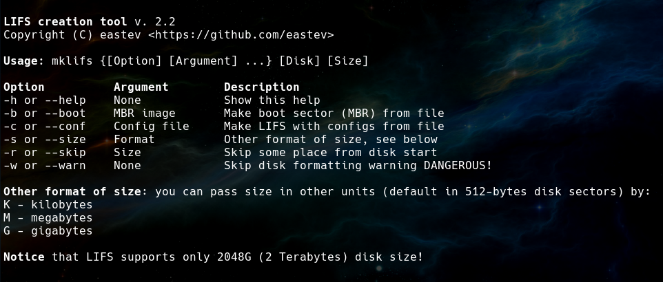

# LIFS cross-platform tool v. 2.2
This tool is created to help in 42IX development, LIFS disk images creation and
possibility to create LIFS under Linux and Windows.

## Archived!
**Further development is a part of XxxxStorageSystem (link will be later).**

## About LIFS 
To see LIFS documentation follow [this link](LIFS.md).

## Compile and use LIFS creation tool
### On Linux
To compile this tool on Linux you need these dependencies installed:
* gcc
* ld
* make
  
Follow these steps to compile LIFS creation tool:
1. Clone tis repo: `git clone https://github.com/eastev/lifs.git`
2. Go to its dir: `cd lifs`
3. Run compilation: `make`
4. If you want - install it: `sudo make install`
5. Profit!
   
To see instructions run: `mklifs -h` and see output.

### On Windows
To compile it on Windows you need `MinGW` and `Git` installed. Follow Linux 
steps wit `MinGW` or `Git bash`. 

## Using configuration file
In this repo there is [an example of configuration file](config_example) for
creating 3 different partitions of minimal size. You can use it to write your 
own config.

LIFS too is a free software licensed under GNU GPL v. 3.0.
